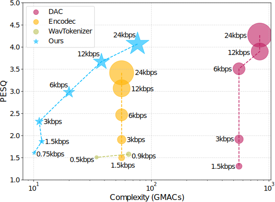

# SQCodec

This repository contains the implementation of SQCodec, a lightweight audio codec based on a single quantizer, introduced in the paper titled "One Quantizer is Enough: Toward a Lightweight Audio Codec".

[Paper](https://arxiv.org/abs/2504.04949)

[Model Weights](https://huggingface.co/zhai-lw/SQCodec)


<figure class="image">
  
  <figcaption>Comparison of various audio codec</figcaption>
</figure>

## install

```
pip install sq_codec
```

### demo

Firstly, make sure you have installed the librosa package to load the example audio file. You can install it using pip:

```
pip install librosa
```

Then, you can use the following code to load a sample audio file, encode it using the SQCodec model, and decode it back
to audio. The code also calculates the mean squared error (MSE) between the original and generated audio.

```python
import librosa
import torch
import sq_codec

all_models = sq_codec.list_models()
print(f"Available models: {all_models}")

MODEL_USED = '6kbps'
codec = sq_codec.get_model(MODEL_USED)
print(f"loaded codec({MODEL_USED}) and codec sample rate: {codec.config.sample_rate}")

sample_audio, sample_rate = librosa.load(librosa.example("libri1"))
sample_audio = sample_audio[None, :]
print(f"loaded sample audio and audio sample_rate :{sample_rate}")

sample_audio = librosa.resample(sample_audio, orig_sr=sample_rate, target_sr=codec.config.sample_rate)

codec.network.cuda()
codec.network.eval()
with torch.inference_mode():
    audio_in = torch.tensor(sample_audio, dtype=torch.float32, device='cuda')
    _, audio_length = audio_in.shape
    print(f"{audio_in.shape=}")
    q_feature, indices = codec.encode_audio(audio_in)
    audio_out = codec.decode_audio(q_feature)  # or
    # audio_out = codec.decode_audio(indices=indices)
    generated_audio = audio_out[:, :audio_length].detach().cpu().numpy()

mse = ((sample_audio - generated_audio) ** 2).mean().item()
print(f"codec({MODEL_USED}) mse: {mse}")
```